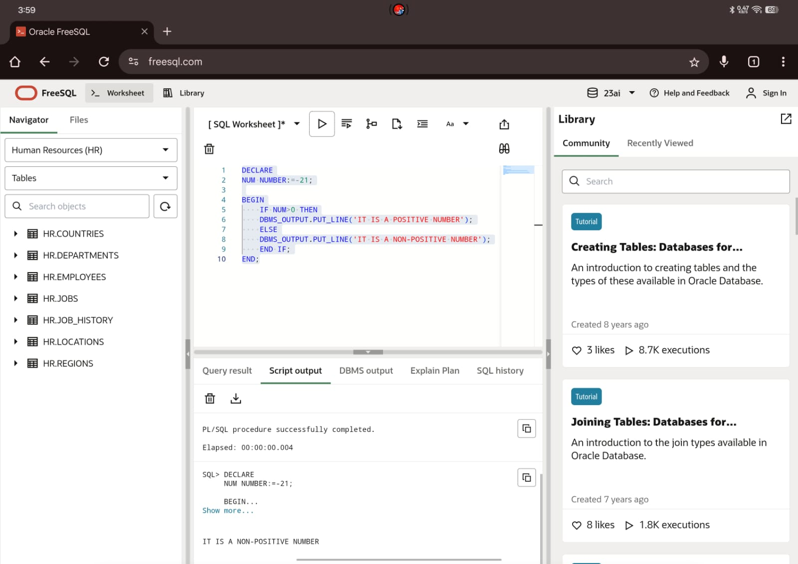
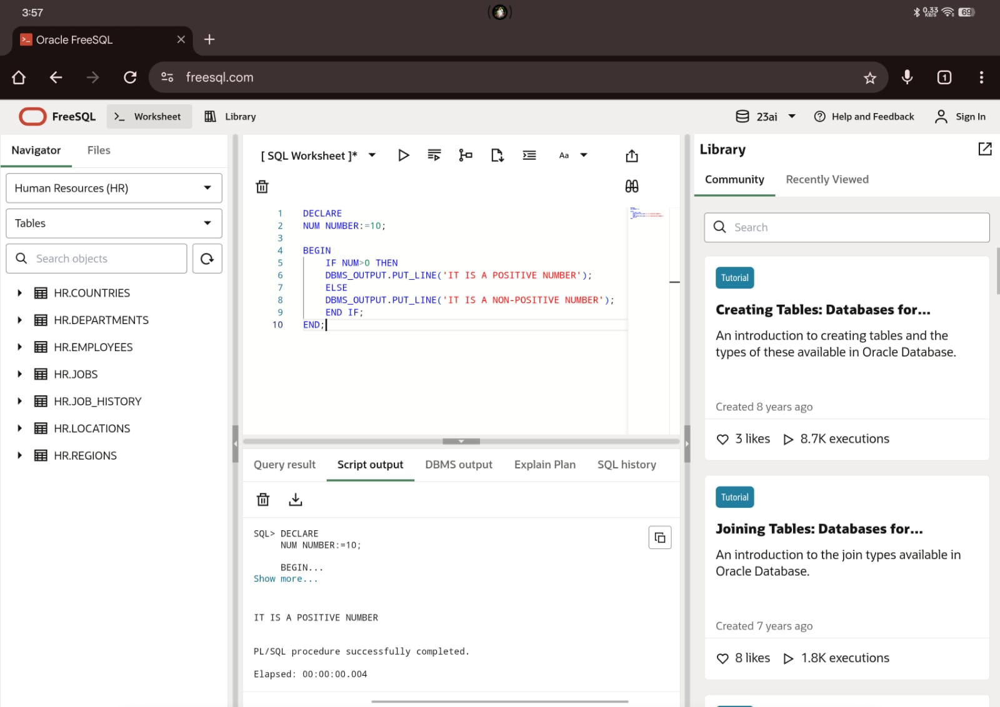
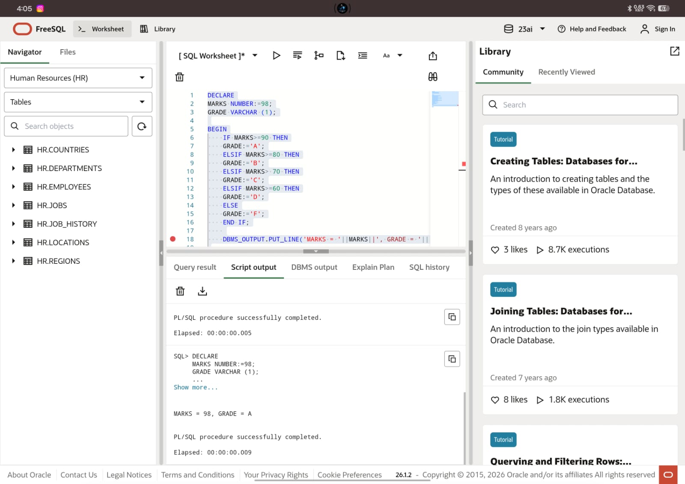
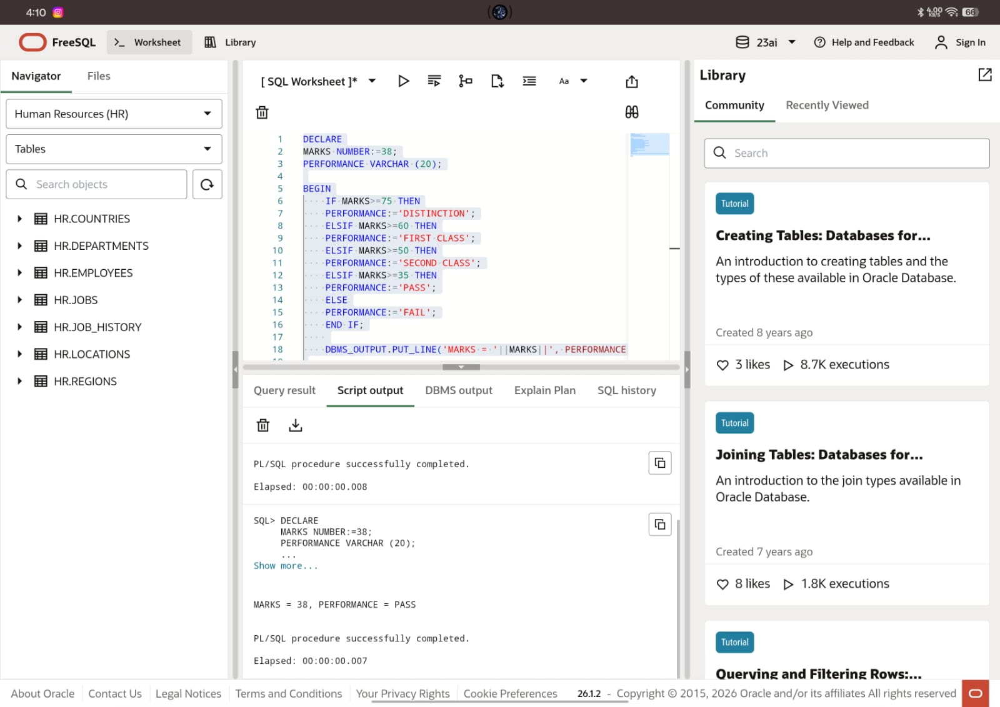
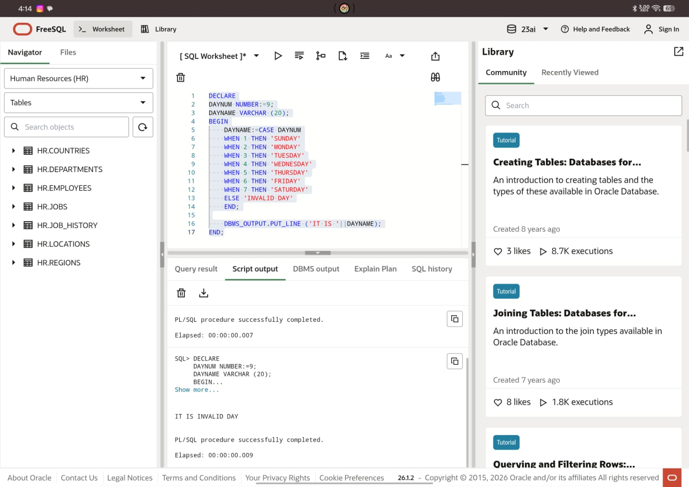
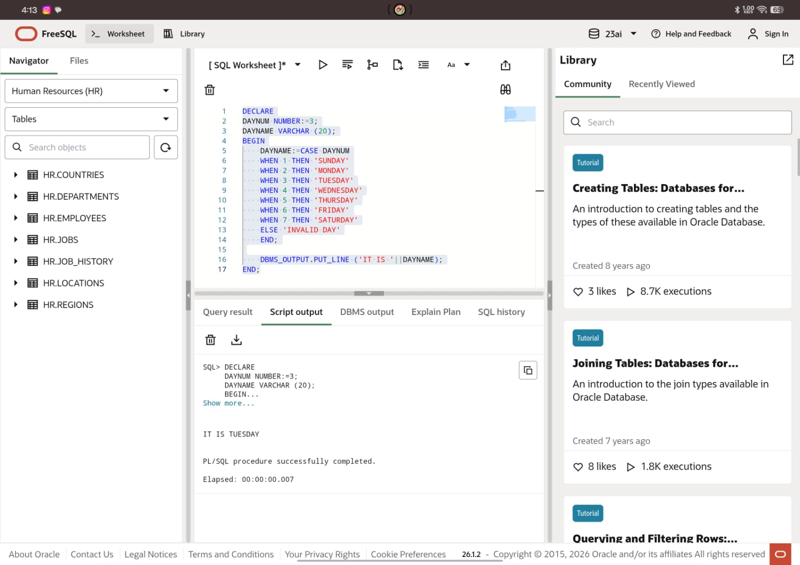

# Experiment 4

## Aim
To design and implement PL/SQL programs utilising conditional control statements such as IF–ELSE, ELSIF, ELSIF ladder, and CASE constructs in order to control the flow of execution based on logical conditions and to analyse decision-making capabilities in PL/SQL blocks.

---

## Objectives
* Implement control structures in PL/SQL (IF-ELSE, ELSE-IF, ELSE-IF LADDER, CASE STATEMENTS in PL-SQL BLOCK).

---

## Practical/Experiment Steps
* Control Structure Implementation: Designed multiple PL/SQL blocks to explore diverse conditional logic formats, including simple branching and multi-path evaluation.
* Logic Branching Analysis: Utilised IF-ELSE and ELSIF ladders to categorise numerical data into specific ranges, such as student grades and performance statuses.
* Selection Optimisation: Implemented the CASE statement as a streamlined alternative to multiple conditional checks for mapping discrete values like day numbers to names.
* Dynamic Messaging: Integrated variable-driven output strings to provide real-time feedback based on the evaluation of input conditions.
* Execution Flow Control: Validated the decision-making capabilities of the PL/SQL engine by testing various input scenarios to ensure the correct code path was activated.


---

## Procedure
1. Enabled the output server environment to ensure all procedural results would be visible in the console window.
2. Constructed a basic IF-ELSE block to perform a binary check on a numerical variable for positive or non-positive properties.
3. Developed an IF-ELSIF-ELSE structure to map student marks to specific letter grades based on defined percentage thresholds.
4. Expanded the conditional logic into a comprehensive ELSIF ladder to categorise performance into tiers such as Distinction, First Class, and Pass.
5. Implemented a CASE statement block to translate integer inputs into corresponding day names, including a default handler for invalid entries.
6. Initialised diverse test values for each variable, such as negative numbers for sign checks and specific marks for grading, to verify logic accuracy.
7. Nested the procedural logic within standard BEGIN...END; blocks to maintain structured programming principles.
8. Executed each block sequentially and monitored the DBMS output console for the expected string concatenations.
9. Verified that the output correctly reflected the logic branch associated with the assigned variable values and documented the results.
10. Verified the console output against the manual calculations to ensure the logic and variables were handled correctly.


---

## I/O Analysis

**1. Input: Positive/Non-Positive Numbers**
```sql
DECLARE
NUM NUMBER:=-21;

BEGIN
    IF NUM>0 THEN
    DBMS_OUTPUT.PUT_LINE('IT IS A POSITIVE NUMBER');
    ELSE
    DBMS_OUTPUT.PUT_LINE('IT IS A NON-POSITIVE NUMBER');
    END IF;
END;
```

**Output:**







**2. Input: Grading System**
```sql
DECLARE
MARKS NUMBER:=68;
GRADE VARCHAR(1);

BEGIN
    IF MARKS>=90 THEN
    GRADE:='A';
    ELSIF MARKS>=80 THEN
    GRADE:='B';
    ELSIF MARKS>=70 THEN
    GRADE:='C';
    ELSIF MARKS>=60 THEN
    GRADE:='D';
    ELSE
    GRADE:='F';
    END IF;

    DBMS_OUTPUT.PUT_LINE('MARKS = '||MARKS||', GRADE = '||GRADE);

END;
```

**Output:**





**3. Input: Performance According to Marks Obtained**
```sql
DECLARE
MARKS NUMBER:=58;
PERFORMANCE VARCHAR(20);

BEGIN
    IF MARKS>=75 THEN
    PERFORMANCE:='DISTINCTION';
    ELSIF MARKS>=60 THEN
    PERFORMANCE:='FIRST CLASS';
    ELSIF MARKS>=50 THEN
    PERFORMANCE:='SECOND CLASS';
    ELSIF MARKS>=35 THEN
    PERFORMANCE:='PASS';
    ELSE
    PERFORMANCE:='FAIL';
    END IF;

    DBMS_OUTPUT.PUT_LINE('MARKS = '||MARKS||' AND PERFORMANCE = '||PERFORMANCE);
END;
```

**Output:**





**4. Input: Day Name from Day Number**
```sql
DECLARE
DAYNUM NUMBER:=3;
DAYNAME VARCHAR(20);

BEGIN
    DAYNAME:=CASE DAYNUM
    WHEN 1 THEN 'SUNDAY'
    WHEN 2 THEN 'MONDAY'
    WHEN 3 THEN 'TUESDAY'
    WHEN 4 THEN 'WEDNESDAY'
    WHEN 5 THEN 'THURSDAY'
    WHEN 6 THEN 'FRIDAY'
    WHEN 7 THEN 'SATURDAY'
    ELSE 'INVALID DAY'
    END;
    
    DBMS_OUTPUT.PUT_LINE('IT IS '||DAYNAME);
END;
```

**Output:**







---

## Learning Outcomes
* Gained proficiency in using IF-ELSE, ELSIF ladders, and CASE statements to control program execution flow.
* Evaluated data variables to automate specific outcomes, such as student grading or performance status.
* Using CASE statements as a streamlined method for mapping discrete values like day numbers to names.
* Skills in setting logical thresholds to categorise raw numerical marks into descriptive classifications
